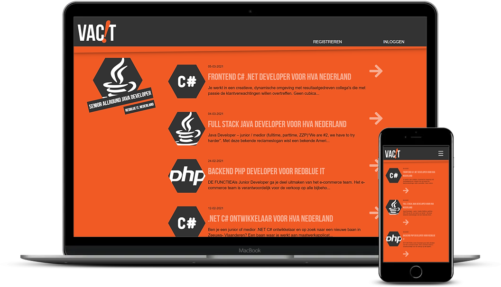
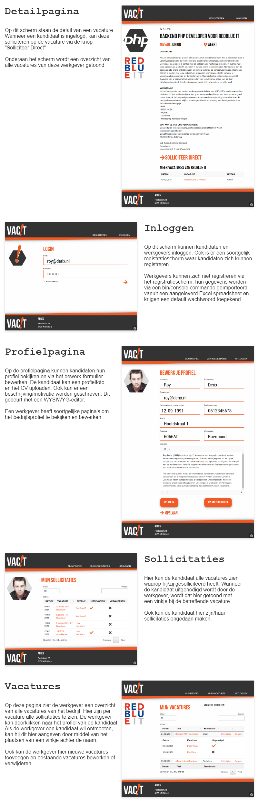
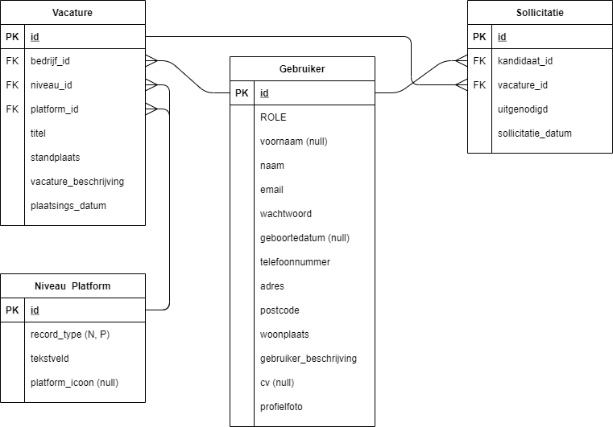
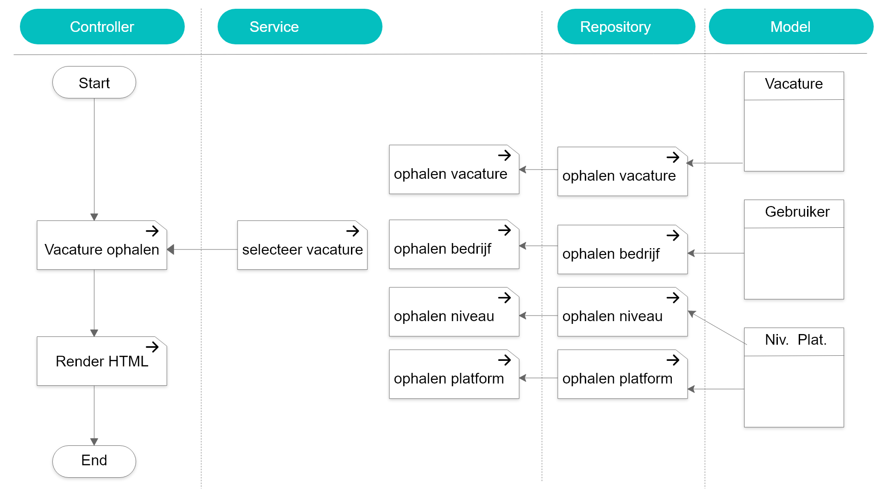

# VacIT!

VacIT is een vacaturesite. Het ontwerp is volledig responsive. Gebruikers loggen in als kandidaat of bedrijf, en er is een admin actief met volledig beheer van alle ingevoerde gegevens.  
Op de homepage staat een lijst met de 5 meest recente vacatures. Het blok aan de linkerkant roteert door alle vacatures met de titel, het niveau, het platform, de werkgever en de standplaats.
Daarnaast is er een alternatieve pagina met een tabel met alle vacatures.

## Technologieën

De back-end applicatie heb ik geschreven in PHP, met behulp van het Symfony framework, en een MySQL database.  
De front-end applicatie heb ik geschreven in HTML en CSS met behulp van template engine TWIG.

De volgende techologieën heb ik gebruikt:

- PHP / JavaScript / jQuery
- Symfony
- HTML / CSS
- Twig
- MySQL
- Foundation
- Datatables / Vegas JS
- Apache

## Methoden & Technieken

### Entity Relationship Diagram

### Application Structure Diagram / Functionele Decompositie

Dit voorbeeld toont het proces voor het ophalen van een vacature.

## Andere projecten:

Verrukkulluk! https://github.com/RoyDerix/Verrukkulluk
ZAPP https://github.com/RoyDerix/Zapp
